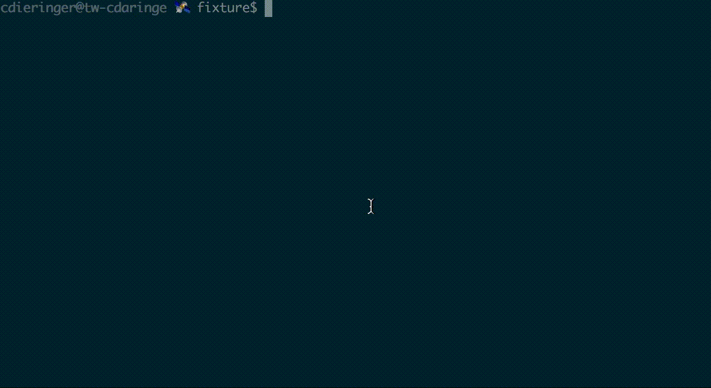

# blackfish

docker-compose cli extensions

## install

`npm install -g blackfish`

## usage



```sh
$ bf --help

  docker* cli extensions

  Usage
    $ bf

  Options
    --compose, -c docker-compose
    --interactive, -i  interactive docker-compose
    --files, -f compose files

  Examples
    $ bf -ci -- up
    $ bf -ci -f docker-compose.yml,docker-compose.dev.yml -- up
```

## warning

- alpha software! ;)
